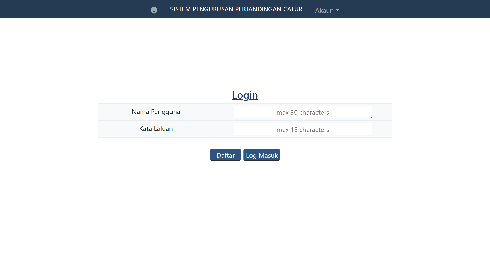
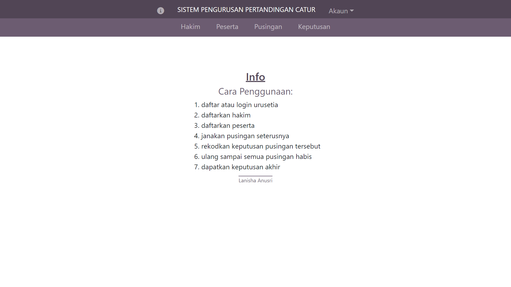
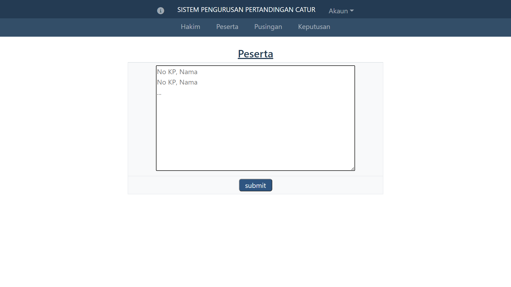
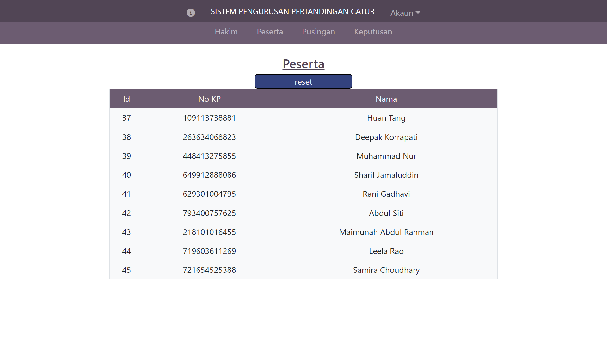
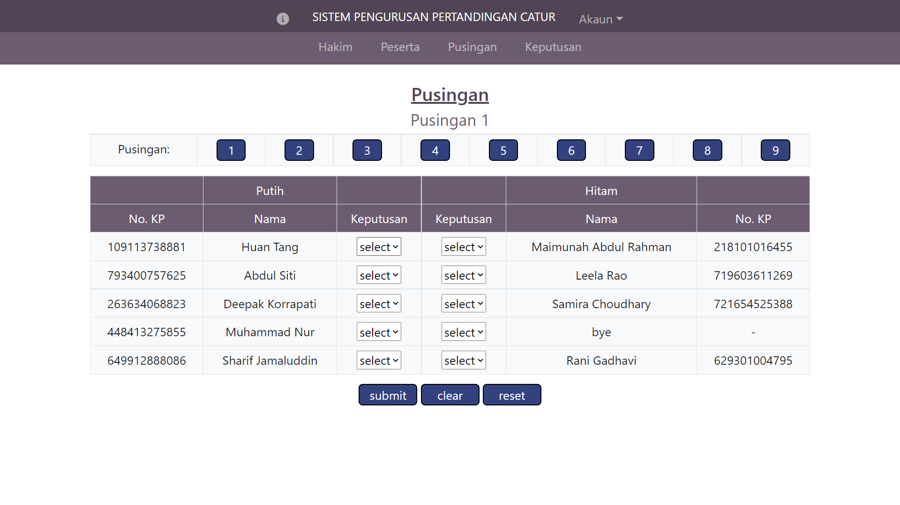
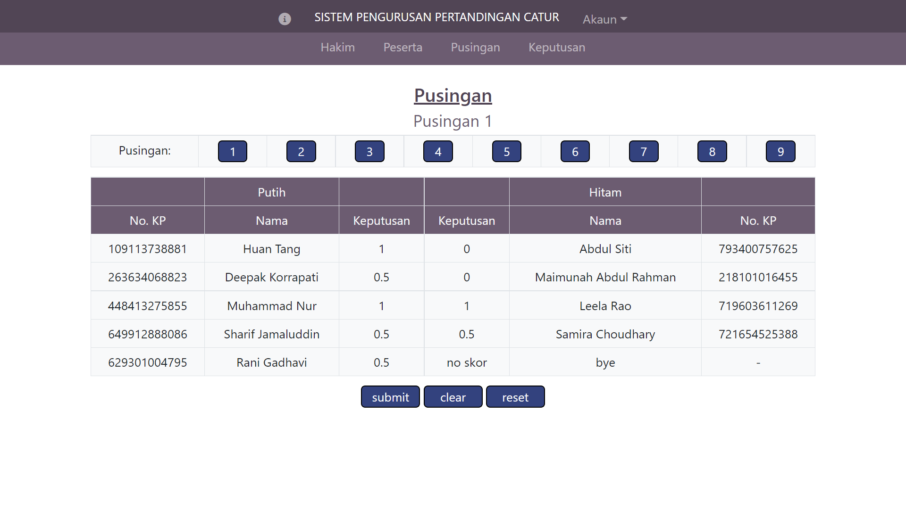
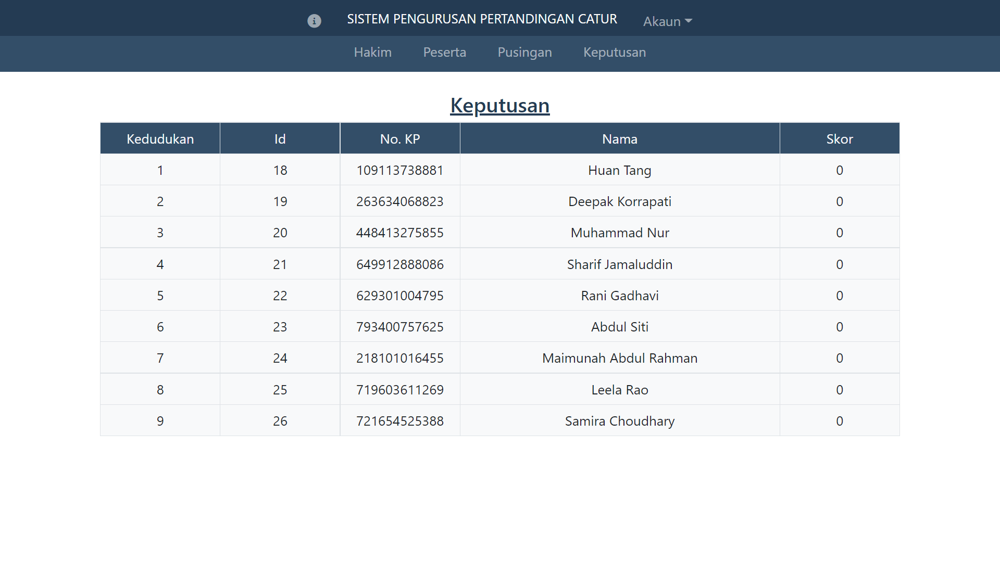
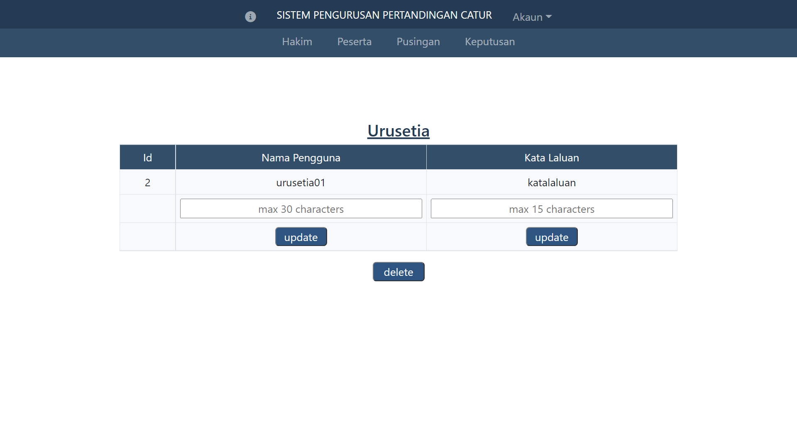

# Sistem Pengurusan Pertandingan Catur (SPPC)
SPPC is a program to manage chess competitions (round robin). The system language is Malay. [](https://github.com/firstcontributions/open-source-badges)


## Installation (using xampp)
⚠️ path and url can differ based on operating system

1. Start xampp.
2. Save and unzip this folder in ```C:/xampp/htdocs/``` 
    - Additionally, you can move the inner folder to htdocs, then rename it to something shorter
3. Create a database (collation: utf8mb4_general_ci) in phpMyAdmin through localhost in your browser ```http://localhost/phpmyadmin/```
4. In sambungan.php, change the database name to the name of the database you created earlier. ```$database = 'database_name';```
5. Go to login.php through localhost in your browser. ```localhost/folder_name/login.php```

## Components
### Database Tables (automatically created)
- urusetia
- hakim
- peserta
- scores
- matches

### Pages
- login.php
- info.php
- urusetia.php
- hakim.php
- peserta.php
- pusingan.php
- keputusan.php

### Components
- styles.css
- head.php
- navbar_1.php
- navbar_2.php
- sambungan.php
- log_keluar.php
- algorithm.php

## Screenshots









